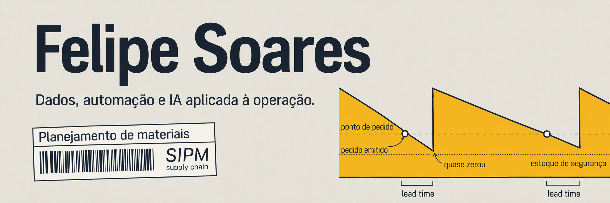
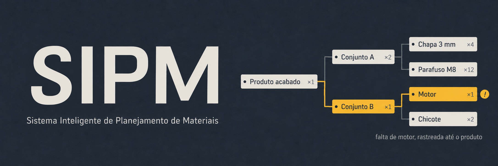

  

  <strong>Planejamento de materiais · Dados · Tecnologia</strong> 
  Transformo desafios de planejamento em processos claros, análises úteis e ferramentas que ajudam a decidir melhor.

  <a href="https://www.linkedin.com/in/felipe-soares-de-miranda-b65131272/">LinkedIn</a> ·
  <a href="https://github.com/FelipeS0ares18">GitHub</a>

## Sobre mim

Sou **Felipe Soares**. Atuo na interseção entre **planejamento de materiais, Supply Chain e tecnologia**: conecto a realidade da operação com dados, automação e desenvolvimento de soluções internas.

Gosto de transformar informações dispersas em visibilidade para o time, critérios de decisão e rotinas mais confiáveis. Meu foco é aplicar tecnologia onde ela melhora o trabalho de quem planeja, compra, produz e acompanha materiais.

## Áreas de atuação

- **Supply Chain & Materials Planning** — abastecimento, estoque, compras, PCP, estrutura de materiais (BOM) e políticas de suprimento.
- **Dados & inteligência operacional** — indicadores, análise de demanda, Power BI, SQL e visualização para apoiar decisões.
- **Automação & sistemas** — integração de processos, ferramentas internas e redução de tarefas repetitivas.
- **AI aplicada** — interfaces e copilotos que ajudam a consultar cenários e explicar recomendações com base em dados.

## Projetos em destaque

### SIPM · Sistema Inteligente de Planejamento de Materiais

Uma solução de planejamento criada para reunir **materiais, demanda, estoque, compras, recomendações e exceções** em uma visão de trabalho. O objetivo é apoiar prioridades diárias e decisões de abastecimento com rastreabilidade e contexto operacional.

**O que o projeto reúne:** motor de planejamento/MRP, políticas por material, análises, simulações e uma rotina estruturada para o planejador. O repositório do SIPM é privado; esta é uma visão geral do projeto.

### Copiloto de Planejamento · módulo do SIPM

Uma camada conversacional para explorar prioridades, rupturas, atrasos e recomendações do planejamento. Ela ajuda a explicar cálculos e comparar cenários hipotéticos, mantendo as regras de negócio no motor de planejamento.

## Stack & ferramentas

**Operação e dados** 
<kbd>Materials Planning</kbd> <kbd>MRP</kbd> <kbd>Excel</kbd> <kbd>Power BI</kbd> <kbd>SQL</kbd> <kbd>Python</kbd>

**Desenvolvimento** 
<kbd>TypeScript</kbd> <kbd>React</kbd> <kbd>Node.js</kbd> <kbd>NestJS</kbd> <kbd>PostgreSQL</kbd> <kbd>Prisma</kbd>

**Entrega e automação** 
<kbd>Git</kbd> <kbd>GitHub</kbd> <kbd>Docker</kbd> <kbd>APIs</kbd> <kbd>AI aplicada</kbd>

## GitHub em números

> **49 contribuições** nos últimos 12 meses · **6 repositórios** no perfil  
> Consulta em 28/09/2026 · [Dados atuais →](https://github.com/FelipeS0ares18#contributions)

## Contato

Quer conversar sobre planejamento de materiais, dados ou tecnologia aplicada à operação?

- [LinkedIn · Felipe Soares](https://www.linkedin.com/in/felipe-soares-de-miranda-b65131272/)
- [GitHub · @FelipeS0ares18](https://github.com/FelipeS0ares18)
